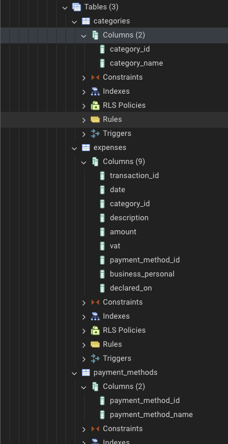

# AI Expense tracker

## Project structure

```shell
.
├── LICENCE.txt
├── README.MD
├── config.yaml
├── data
│   └── walmart-bon.jpeg
├── documents
│   ├── api_documentation.png
│   └── pg_admin_screenshot.png
├── env.example
├── requirements.txt
└── src
    ├── api
    │   ├── __init__.py
    │   ├── category_routes.py
    │   ├── expenses_routes.py
    │   ├── payment_methods_routes.py
    │   └── run_api.py
    ├── chain
    │   ├── __init__.py
    │   ├── graphstate.py
    │   ├── helpers
    │   │   ├── __init__.py
    │   │   └── get_payment_methods_and_categories.py
    │   └── nodes
    │       ├── __init__.py
    │       ├── categorizer.py
    │       ├── correct.py
    │       ├── db_entry.py
    │       ├── humancheck.py
    │       ├── imageencoder.py
    │       └── jsonparser.py
    └── database
        ├── __init__.py
        ├── create_categories_and_payment_methods.py
        ├── create_tables.py
        └── db_connection.py
```

## Step by step

### 1. Create Project

**1.1 Create virtual environment**\
Using Conda, venv or any other tool of your liking. 

**1.2 activate virtual environment**

**1.3 clone repo**\
!TO DO!

**1.4 install requirements**\
!TO DO!

**1.5 create .env file**\
See example [here](.env.example).

---

### 2. Set up the database

#### 2.1 Prerequisites

**2.1.1 Install postgresql:**
```shell
brew install postgresql
```
*(other ways to [install Postgresql](https://www.postgresql.org/ "Postgresql Homepage"))*

**2.1.2 Install Docker:**
```shell
brew install docker
```
*(other ways to [install Docker](https://www.docker.com// "Docker Homepage"))*

#### 2.2 Make a Docker container

**2.2.1 Create:**
```shell
docker run -d \
  --name postgres-expenses \
  -e POSTGRES_USER=expenses \
  -e POSTGRES_PASSWORD=money$ \
  -e POSTGRES_DB=expenses \
  -p 6025:5432 \
  postgres:latest
```
**2.2.2 Control:**\
Use the following command to see if the container is running correctly:
```shell
docker ps
```
it should show a list of running containers.

#### 2.3 Configure database

**2.3.1 Create tables**\
Add tables for our expense tracking by running the `/src/database/create_tables.py` script *([link](src/database/create_tables.py))*

**2.3.2 Inspect tables**\
Using a tool link [PGAdmin](pgadmin.org), you can inspect if the tables in the database are all there.



### 3. set up API

-Go to the root folder of your project and activate virtual environment
```shell
CD path/to/your/projectfolder
workon expense-tracker
```
*i have some shell aliases set up, the [workon] command should probably be something like [conda activate] or [source [env]]*

-activate virtual environment
```shell
(expense_tracker)
~/Developer/expense_tracker
▶ uvicorn src.api.run_api:app --reload
INFO:     Will watch for changes in these directories: ['/Users/jw/developer/expense_tracker']
INFO:     Uvicorn running on http://127.0.0.1:8000 (Press CTRL+C to quit)
INFO:     Started reloader process [12588] using StatReload
INFO:     Started server process [12590]
INFO:     Waiting for application startup.
INFO:     Application startup complete.
```

You can visit [http://localhost:8000/docs#/](http://localhost:8000/docs#/) for a page with documentation about the API: 


## Database

The database consists of three main tables: `categories`, `payment_methods`, and `expenses`.

### Table: categories
This table contains a list of categories for expenses. Each category has a unique ID and a name.

- **Columns**:
  - `category_id` (SERIAL, Primary Key): The unique ID for the category.
  - `category_name` (VARCHAR(100), Unique): The name of the category.

### Table: payment_methods
This table contains various payment methods that can be used for expenses.

- **Columns**:
  - `payment_method_id` (SERIAL, Primary Key): The unique ID for the payment method.
  - `payment_method_name` (VARCHAR(50), Unique): The name of the payment method.

### Table: expenses
This is the main table for tracking expenses. It contains information such as the date, the category (with a reference to the `categories` table), the payment method (with a reference to the `payment_methods` table), the amount, VAT, and other details.

- **Columns**:
  - `transaction_id` (SERIAL, Primary Key): The unique ID for the transaction.
  - `date` (DATE): The date of the expense.
  - `category_id` (INTEGER, Foreign Key): Reference to the `categories` table.
  - `description` (TEXT): A short description of the expense.
  - `amount` (DECIMAL(10, 2)): The amount of the expense.
  - `vat` (DECIMAL(10, 2)): The VAT for the expense.
  - `payment_method_id` (INTEGER, Foreign Key): Reference to the `payment_methods` table.
  - `business_personal` (VARCHAR(50)): Indicates whether the expense is business or personal.
  - `declared_on` (DATE): The date when the expense was declared.

## API 
See API documentation here: [openapi.json](documents/openapi.json)
